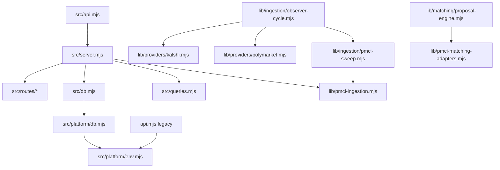

# Repository Audit and Structured Refactor Plan (2026-03-09)

## 1) Repository Architecture Summary

### 1.1 Runtime surfaces and responsibilities

- **Legacy execution API (`api.mjs`, root):** Node `http` server for `/signals/top`, `/execution-decision`, and `/routing-decisions/top`; explicitly marked deprecated but still runnable via `npm run api`.
- **Active PMCI API (`src/api.mjs` + `src/server.mjs`):** Fastify app with routes split into `src/routes/*` and data access via `src/db.mjs` + `src/queries.mjs`.
- **Ingestion core (`lib/ingestion/*`, `lib/pmci-ingestion.mjs`, `lib/providers/*`):** Provider fetch/adaptation, market upserts, snapshot writes, and PMCI-specific ingestion.
- **Matching/proposal engine (`lib/matching/proposal-engine.mjs`, `lib/pmci-matching-adapters.mjs`):** Link proposal logic and similarity/matching heuristics.
- **Operational scripts (`scripts/*.mjs`):** Ingestion probes, schema verification, bootstrap/seeding, audits, and CLI review flows.

### 1.2 High-level dependency graph



### 1.3 Data flow (major paths)

1. **Provider ingestion path:** provider adapters normalize raw market/event data → `lib/pmci-ingestion.mjs` upserts `provider_markets` and appends `provider_market_snapshots`.
2. **API read path:** route handlers validate query/body params with `zod`, resolve provider IDs, run SQL from `src/queries.mjs`, and return transformed JSON payloads.
3. **Review/proposal path:** proposal engine writes candidates, review route accepts/rejects/attaches proposals, then writes linker runs and market links.

---

## 2) Key Problems Identified

### 2.1 Code quality issues

- **God modules / oversized files**
  - `lib/matching/proposal-engine.mjs` (~1507 LOC) and `lib/ingestion/universe.mjs` (~920 LOC) are large and multipurpose.
  - `src/routes/health.mjs` (~339 LOC) and `src/routes/review.mjs` (~299 LOC) mix validation, orchestration, and DB writes in single route modules.

- **Duplicated logic patterns**
  - Provider-code → provider-id resolution query is repeated across coverage, markets, and review routes.
  - Similar request validation and error-object shape handling is repeated route-by-route.
  - Percentile helper exists in multiple places (`src/server.mjs`, `src/db.mjs`) with equivalent behavior.

- **Inconsistent runtime patterns**
  - Two live HTTP stacks (legacy `api.mjs` and Fastify PMCI API) increase ambiguity on “current” API surface.
  - Root-level executable scripts and `src/` runtime coexist without clear boundary conventions.

- **Unclear abstraction boundaries**
  - Route modules perform SQL orchestration directly instead of delegating to service/repository layers.
  - `lib/pmci-ingestion.mjs` mixes DB persistence, embedding lifecycle, and ingestion flow.

### 2.2 Risk analysis

- **Fragile modules**
  - Review route acceptance flow does multi-step writes (families, linker_runs, links, review decisions, proposal updates) without an explicit transaction boundary in route logic.
  - Matching engine complexity concentrated in one large file increases regression risk for edits.

- **Tight coupling**
  - SQL constants are globally centralized in `src/queries.mjs` and invoked from routes directly; schema changes cascade broadly.
  - Environment loading, database setup, and runtime behavior are tightly linked in entrypoints.

- **Potential runtime bug vectors**
  - Integration-style tests depend on externally running API/DB and are skipped in default local runs, reducing early detection.
  - Mixed nullable/number coercions are manually repeated (e.g., conversion in response mappers), creating edge-case drift.

- **Circular dependencies**
  - No obvious circular import chain in `src/` + `lib/` direct imports, but there is broad fan-in to central files (`src/server.mjs`, `src/queries.mjs`, `lib/pmci-ingestion.mjs`).

### 2.3 Maintainability concerns

- **Naming/organization drift**
  - Runtime entrypoints at root (`api.mjs`, `observer.mjs`, `intelligence-feed.mjs`) alongside `src/` app entrypoint complicate discoverability.
  - `lib/` contains both domain logic and infrastructure-ish concerns.

- **Testing gaps**
  - No dedicated unit tests for many route helper paths and shared utility semantics.
  - Several tests are integration probes that skip when environment services are absent.

- **Configuration sprawl**
  - Large env surface spread across ingestion, API, review, and scripts without a single typed configuration contract.

---

## 3) Refactor Strategy

### Guiding principles

1. **Behavior-preserving first** (extract/move without semantic change).
2. **Low-risk increments** (small PR-sized batches + focused tests).
3. **Boundary hardening before rewrites** (introduce seams: services/repos/utils).

### 3.1 Architectural improvements

- Introduce an **application layer** for API route orchestration:
  - `src/services/coverage-service.mjs`, `markets-service.mjs`, `signals-service.mjs`, `review-service.mjs`.
- Add **repository layer** for DB queries:
  - `src/repositories/providers-repo.mjs`, `families-repo.mjs`, `links-repo.mjs`, etc.
- Keep route files thin: validation + calling service + HTTP response mapping.

### 3.2 Module boundary changes

- Split `lib/pmci-ingestion.mjs` into:
  - `lib/ingestion/repositories/provider-market-repo.mjs`
  - `lib/ingestion/services/snapshot-writer.mjs`
  - `lib/ingestion/services/embedding-service.mjs`
  - `lib/ingestion/orchestrators/pmci-ingest-orchestrator.mjs`
- Split `lib/matching/proposal-engine.mjs` by pipeline stages:
  - candidate generation, scoring, filters, persistence.

### 3.3 File-structure improvements (proposed)

```text
src/
  app/
    api.mjs
    server.mjs
  routes/
  services/
  repositories/
  domain/
    models/
    value-objects/
  platform/
  utils/

lib/
  ingestion/
    adapters/
    orchestrators/
    services/
    repositories/
  matching/
    candidate-generation/
    scoring/
    filters/
    persistence/
  providers/

scripts/
  audit/
  ingestion/
  validation/
  bootstrap/

test/
  unit/
  integration/
  contract/
```

### 3.4 Naming and abstraction improvements

- Normalize route helper naming (`resolveProviderIdByCode`, `parseSinceQuery`, `buildMarketCard`).
- Standardize `*_repo` and `*_service` suffixes.
- Introduce shared typed DTO contracts in `src/domain/models` for route outputs.

### 3.5 Shared utility opportunities

- `resolveProviderIdByCode(query, code)` utility/repository method.
- Shared stats helpers (`percentile`, rolling metrics) in one utility module.
- Shared response mappers for market/snapshot payload shapes.

### 3.6 Testing improvements

- Add deterministic **unit tests** for:
  - provider resolution helper
  - parseSince + date coercion
  - consensus/divergence calculations
  - review acceptance branching logic (with DB mocks)
- Keep integration tests, but tag/partition as `integration` and run in CI with service containers.

---

## 4) Step-by-Step Refactor Plan

### Transaction ownership rule (applies to Steps 0–8)

**Decision: Option A — services receive DB client/transaction from caller.**

- **Why this fits current architecture:** route handlers already receive a single `query` dependency and orchestrate multi-step workflows. Passing a scoped DB executor (`query` or transactional client) into services preserves existing call patterns while enabling explicit transaction boundaries for complex flows.
- **Operational effect:** simple read-only paths can keep using default pooled `query`; multi-write workflows (review acceptance, linker run + links + proposal decision updates) must execute through a single transaction-scoped client passed into service/repository calls.
- **Guardrail:** services must never open nested implicit transactions; transaction scope is owned by the caller/composition root.

### Step 0 — Blocker fix: eliminate duplicate key writes on `ux_pmci_market_links_identity`
- **Objective:** ship a minimal safe fix before any structural refactor.
- **Files affected (expected):** `src/routes/review.mjs`, `src/queries.mjs`, and minimal supporting DB helper for transaction client usage.
- **Scope (minimal, no large rewrite):**
  1. Diagnose duplicate insert path in review acceptance/manual resolve flows.
  2. Make market-link writes idempotent at query level (`ON CONFLICT ON CONSTRAINT ux_pmci_market_links_identity DO UPDATE/DO NOTHING` based on intended behavior).
  3. Wrap acceptance workflow writes in a single transaction boundary (family lookup/create, linker_run insert, link inserts/upserts, proposal decision update, review decision insert).
  4. Ensure rollback on failure to prevent partial writes.
- **Expected impact:** stops duplicate-key runtime failures and prevents half-committed acceptance state.
- **Regression risk:** Medium (write-path touch), but constrained blast radius.
- **Validation:**
  - Re-run same accept/resolve request twice and confirm deterministic non-error behavior.
  - Verify no duplicate active links for the same `(family_id, provider_id, provider_market_id)` identity.
  - Confirm proposal/review/linker records remain consistent after forced failure test.

### Step 1 — Establish shared provider-resolution and validation utilities
- **Objective:** Remove duplicated provider lookup/validation patterns from routes.
- **Files affected:** `src/routes/{coverage,markets,review}.mjs`, new `src/repositories/providers-repo.mjs`, optional `src/utils/validation.mjs`.
- **Expected impact:** Less duplication, consistent error handling.
- **Regression risk:** Low.
- **Validation:** Existing route tests + add unit tests for provider repo helper.

### Step 2 — Extract pure calculation helpers from `src/server.mjs`
- **Objective:** Move percentile/consensus/divergence/parseSince to `src/utils/metrics.mjs` and `src/utils/time.mjs`.
- **Files affected:** `src/server.mjs`, new `src/utils/*`, corresponding tests.
- **Expected impact:** Smaller server bootstrap, reusable helpers.
- **Regression risk:** Low.
- **Validation:** Unit tests for helpers; smoke `node --test`.

### Step 3 — Introduce service layer per route family
- **Objective:** Decouple route handlers from SQL orchestration.
- **Files affected:** `src/routes/*.mjs`, new `src/services/*.mjs`.
- **Expected impact:** Cleaner route boundaries, easier testing/mocking.
- **Regression risk:** Medium-low.
- **Validation:** Route contract tests (HTTP response shape/status).

### Step 4 — Split `lib/ingestion/universe.mjs` into orchestrator + repos/services
- **Objective:** Decompose the actual ingestion god module (`lib/ingestion/universe.mjs`, ~920 LOC) and isolate concerns.
- **Files affected:** `lib/ingestion/universe.mjs` and new `lib/ingestion/{orchestrators,repositories,services}/*`.
- **`lib/pmci-ingestion.mjs` handling:** keep mostly intact; only touch if required to integrate extracted `universe` boundaries.
- **Expected impact:** better ingestion isolation and easier failure handling.
- **Regression risk:** Medium.
- **Validation:** Ingestion unit tests + script-level smoke (`pmci:probe`, `pmci:smoke`).

### Step 4.5 — Capture golden fixtures before proposal engine decomposition
- **Objective:** freeze known-good proposal engine outputs before modifying `lib/matching/proposal-engine.mjs`.
- **Files affected:** new fixtures under `test/fixtures/matching/` plus capture script/test harness.
- **Fixture scope:** representative outputs from a known-good run (candidate pairs, scores/reasons, accepted filtering outcomes, persisted proposal payload shape).
- **Expected impact:** deterministic regression baseline for Step 5.
- **Regression risk:** Low.
- **Validation:** fixture generation reproducible; regression comparator test passes pre-refactor baseline.

### Step 5 — Decompose `lib/matching/proposal-engine.mjs` with existing-work check
- **Objective:** Split pipeline stages and reduce file complexity while avoiding duplicate implementation.
- **Pre-check requirement (mandatory):** audit `lib/matching/` for existing partial decomposition work before creating new modules.
  - Current repository check: only `proposal-engine.mjs` is present (no `lib/matching/matchers/` directory found in this audit).
  - If new matching modules appear before execution starts, map responsibilities first and reuse them.
- **Files affected:** `lib/matching/proposal-engine.mjs` + new stage modules only where not already implemented.
- **Expected impact:** safer incremental tuning of matching heuristics.
- **Regression risk:** Medium-high.
- **Validation:** existing matching tests + golden fixture regression comparisons from Step 4.5.

### Step 6 — Consolidate entrypoints and runtime boundaries
- **Objective:** Clarify active vs legacy APIs and enforce package scripts ownership.
- **Files affected:** `package.json`, `README.md`, `docs/system-state.md`, optionally move legacy API to `legacy/`.
- **Expected impact:** Reduced operator confusion and cleaner onboarding.
- **Regression risk:** Low.
- **Validation:** Manual start checks (`npm run api`, `npm run api:pmci`).

### Step 7 — Reorganize scripts by domain + add lightweight CLI conventions
- **Objective:** Improve discoverability for operational scripts.
- **Files affected:** `scripts/*` (move only), update package scripts.
- **Expected impact:** Lower cognitive load for operators.
- **Regression risk:** Low-medium (path updates).
- **Validation:** Execute representative scripts from each folder.

### Step 8 — Formalize config contract
- **Objective:** Centralized env parsing with schema validation and defaults docs.
- **Files affected:** `src/platform/env.mjs`, new `src/platform/config-schema.mjs`, docs.
- **Expected impact:** Earlier failure for misconfiguration; less hidden behavior.
- **Regression risk:** Medium.
- **Validation:** Unit tests for required/optional vars; startup smoke.

### Summary of plan amendments and rationale

1. **Added Step 0 blocker** to fix duplicate-key/idempotency and transaction-boundary issues first, because refactoring while write paths are failing increases incident risk.
2. **Corrected ingestion target in Step 4** from `lib/pmci-ingestion.mjs` to `lib/ingestion/universe.mjs` (actual large module).
3. **Inserted Step 4.5 fixture capture** to create golden regression baselines before touching the ~1500 LOC proposal engine.
4. **Declared transaction ownership (Option A)** so transaction scope is explicit and composable across services/repositories.
5. **Updated Step 5 with existing-work check** so decomposition reuses any present matching modules and avoids duplicated implementation.

## 5) Example Code Improvements

### Example A — Deduplicate provider lookup

**Current pattern (repeated in multiple routes):** query provider by code + rowCount check + unknown_provider return.

**Suggested abstraction:**
- `providers-repo.resolveIdByCode(code)` returns `{ ok: true, id } | { ok: false, error: "unknown_provider" }`.
- Route handlers consume one canonical behavior.

### Example B — Isolate review acceptance transaction workflow

**Current:** route handler coordinates multi-step writes inline.

**Suggested:**
- `review-service.acceptProposal({ proposedId, relationshipType, note })` executes a single transactional workflow.
- Route remains focused on input parsing + response mapping.

### Example C — Split ingestion embedding side effects

**Current:** embedding generation and DB upsert/snapshot logic are interleaved.

**Suggested:**
- `market-upsert-service` handles persistence.
- `embedding-service` runs opportunistically and emits non-fatal events/metrics.
- Orchestrator coordinates ordering and retry policy.

### Example D — Consistent time parsing

**Current:** relative/ISO parsing utility lives in server context.

**Suggested:** shared `parseSinceQuery` utility with explicit test matrix (`24h`, `7d`, ISO, invalid).

---

## 6) Suggested Long-Term Improvements

1. **Introduce architecture tests/lint rules** to prevent direct route→SQL coupling regressions.
2. **Adopt typed API contracts** (OpenAPI-generated validators/types) to reduce manual coercion drift.
3. **Add CI matrix** with unit-only fast lane + integration lane (API+DB containers).
4. **Telemetry baseline** for ingestion/matching stage durations and failure domains.
5. **Data-access migration strategy**: gradually move from ad-hoc SQL strings to repository query modules with ownership.

---

## Technical Debt Backlog (ranked by impact)

1. **Very High:** `lib/matching/proposal-engine.mjs` monolith decomposition.
2. **Very High:** Inline transactional review acceptance logic in route layer.
3. **High:** Route-level provider lookup and validation duplication.
4. **High:** `lib/pmci-ingestion.mjs` mixed concerns (embedding + persistence + orchestration).
5. **High:** Dual API runtime surfaces (legacy + PMCI) without strict ownership boundaries.
6. **Medium:** Script sprawl and naming inconsistencies.
7. **Medium:** Incomplete automated coverage for key route/service logic.
8. **Medium:** Config surface fragmentation and implicit defaults.
9. **Low-Medium:** Utility duplication (percentile/time parsing/mapper helpers).
10. **Low:** Folder taxonomy drift between historical and active code.

---

## Appendix — Audit commands executed

- `rg --files | head -n 200`
- `cat package.json`
- `find src lib test scripts -type f \( -name '*.mjs' -o -name '*.ts' \) -print0 | xargs -0 wc -l | sort -nr | head -n 25`
- `python ...` (import graph extraction for `src/` + `lib/`)
- `node --test`
- targeted file reads via `sed -n` for: README, server/routes/db/queries/ingestion/system-state and entrypoints.
