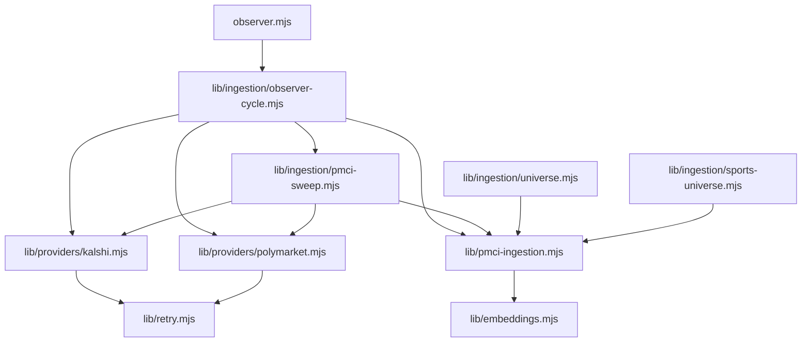

# Subagent 1 — Repo blocker audit (ingestion & matching)

**Repo inspected:** `prediction-machine` worktree `lby` (paths below are repo-relative).

**Assumptions:** Execution layer depends on fresh `pmci.provider_market_snapshots`, populated `provider_markets`, and cross-venue links/proposals. Sports bulk ingest + sweep + matching are on the critical path.

---

## Ingestion component map



**Narrative:** Observer cycle and PMCI sweep pull prices through `lib/providers/*` and append snapshots via `lib/pmci-ingestion.mjs`. Politics and sports **universe** scripts call `ingestProviderMarket` directly with their own HTTP stacks (sports partially diverges from provider modules).

---

## Prioritized blockers

### P0 — PMCI sweep excludes `status = 'active'` rows

| Field | Detail |
|--------|--------|
| **Path** | `lib/ingestion/pmci-sweep.mjs` |
| **Symbol** | `SQL_STALE_MARKETS` (`pm.status IS NULL OR pm.status = 'open'`) |
| **Why it blocks** | Sports Polymarket ingestion writes `status: "active"` for live rows (`lib/ingestion/sports-universe.mjs` ~407–419). Kalshi path treats `active` and `open` as live (~216–218). Those rows never match the sweep query, so post-observer refresh **skips** a large share of sports (and any other `active` rows), starving snapshots unless the heavy universe job reruns. |
| **Fix** | Treat live statuses consistently in SQL, e.g. `lower(coalesce(pm.status,'')) in ('open','active')` (align with DB constraints), or normalize all writers to one canonical live status. |

### P0 — Per-market OpenAI embeddings on bulk `ingestProviderMarket`

| Field | Detail |
|--------|--------|
| **Path** | `lib/pmci-ingestion.mjs` |
| **Symbol** | `ingestProviderMarket` → `ensureTitleEmbedding` → `lib/embeddings.mjs` `embed` |
| **Why it blocks** | Every successful upsert triggers embedding work when keys are present. Bulk sports loops call `ingestProviderMarket` per market; wall time scales with **markets × (DB + OpenAI)**. Failures are logged but latency dominates. |
| **Fix** | Env-gate embeddings for bulk jobs, batch via existing batch helpers, or skip for high-volume categories until a background pass. |

### P1 — Sports Kalshi ingest: sequential, sleeps, small pages

| Field | Detail |
|--------|--------|
| **Path** | `lib/ingestion/sports-universe.mjs` |
| **Symbol** | `ingestKalshiSports` |
| **Why it blocks** | Series → events → `/markets` per event (`limit=200`) → per-market `ingestProviderMarket`. Fixed sleeps between batches. Politics path in `lib/ingestion/universe.mjs` uses chunked concurrency (`PMCI_POLITICS_KALSHI_CONCURRENCY`); sports does not. |
| **Fix** | Reuse politics-style bounded concurrency + tunable env; measure 429s before removing sleeps. |

### P1 — Sports Polymarket `fetchJson`: no timeout, no retry

| Field | Detail |
|--------|--------|
| **Path** | `lib/ingestion/sports-universe.mjs` |
| **Symbol** | `fetchJson` (~89–101), used by sports Gamma calls |
| **Why it blocks** | `lib/providers/polymarket.mjs` uses `retry` + `fetchWithTimeout`; sports universe does not → hung requests and transient errors stall full runs. |
| **Fix** | Route sports HTTP through `lib/retry.mjs` (same as providers). |

### P1 — `fetchKalshiWithRetry` may not try failover base on final attempt

| Field | Detail |
|--------|--------|
| **Path** | `lib/ingestion/sports-universe.mjs` |
| **Symbol** | `fetchKalshiWithRetry` (~103–118) |
| **Why it blocks** | On `attempt === maxRetries`, the `catch` path does `throw err` inside the inner `for (const base of KALSHI_BASES)` loop after the first base fails, so the **second** base may never be attempted on the last retry. |
| **Fix** | Only throw after all bases fail for that attempt; then increment attempt / sleep. |

### P2 — Hard caps / truncation

| Field | Detail |
|--------|--------|
| **Path** | `lib/ingestion/sports-universe.mjs` |
| **Evidence** | Event pagination stops after `evPage > 20`; `/series` uses `limit=10000`; markets `limit=200` per event. |
| **Why it blocks** | Tail of large series or wide events never ingests. |
| **Fix** | Cursor/limit parity with provider docs; log + metrics when caps hit. |

### P2 — `/tmp` file lock (single host)

| Field | Detail |
|--------|--------|
| **Path** | `lib/ingestion/sports-universe.mjs` |
| **Symbol** | `LOCK_FILE`, `acquireLock` |
| **Why it blocks** | No cross-host coordination; stale PID checks are OS-specific. |
| **Fix** | Postgres advisory lock or lease row when `DATABASE_URL` is available. |

### P2 — Proposal engine hard-coded to politics

| Field | Detail |
|--------|--------|
| **Path** | `lib/matching/proposal-engine.mjs` |
| **Symbol** | `const CATEGORY = 'politics'` (~43) |
| **Why it blocks** | Automated equivalent/proxy proposals for sports (and future verticals) do not flow through this engine; sports has separate scripts/helpers but ingestion can outrun matching. |
| **Fix** | Parameterize category + SQL filters, or dedicated sports engine module sharing scoring primitives. |

### P2 — Brittle Polymarket outcome attachment (observer path)

| Field | Detail |
|--------|--------|
| **Path** | `lib/providers/polymarket.mjs` |
| **Symbol** | `buildPolymarketPriceMap` (substring / `includes` on outcome names) |
| **Why it blocks** | Collisions and wording drift → wrong or missing YES price for paired observation. |
| **Fix** | Prefer stable IDs (`conditionId`, clob token, outcome index) aligned with universe metadata. |

---

## “Fix now” shortlist (top 3)

1. **Sweep SQL:** include live `active` status (or normalize DB to one live status) — `lib/ingestion/pmci-sweep.mjs`.
2. **Gate/batch embeddings** on bulk ingest — `lib/pmci-ingestion.mjs` + sports/politics universe entrypoints.
3. **Harden sports Gamma HTTP** (timeout + retry) — `lib/ingestion/sports-universe.mjs`; fix `fetchKalshiWithRetry` throw ordering in the same pass.

---

## Tests, fixtures, schema drift

| Gap | Notes |
|-----|--------|
| No tests for `sports-universe` or `pmci-sweep` | Search `test/` for those symbols — coverage is missing vs `test/ingestion/*` for parsers/metadata. |
| `test/ingestion/observer-cycle.test.mjs` | Does not exercise `runObserverCycle` (naming vs behavior). |
| Status vocabulary | `universe.mjs` treats `open`/`active` as live in places; `pmci-sweep.mjs` only `open`; sports writes `active` — documented mismatch risk. |
| Docs vs repo | Some docs reference `tests/sport-inference.test.mjs`; confirm whether test exists in your branch. |

---

## Code references (evidence)

```11:16:lib/ingestion/pmci-sweep.mjs
const SQL_STALE_MARKETS = `
  SELECT pm.id, pm.provider_market_ref, pm.event_ref, p.code AS provider_code
  FROM pmci.provider_markets pm
  JOIN pmci.providers p ON p.id = pm.provider_id
  WHERE (pm.status IS NULL OR pm.status = 'open')
```

```43:43:lib/matching/proposal-engine.mjs
const CATEGORY = 'politics';
```

```103:118:lib/ingestion/sports-universe.mjs
async function fetchKalshiWithRetry(url, { maxRetries = 3, stats } = {}) {
  for (let attempt = 0; attempt <= maxRetries; attempt++) {
    for (const base of KALSHI_BASES) {
      try {
        const u = url.replace(KALSHI_BASES[0], base).replace(KALSHI_BASES[1], base);
        return await fetchJson(u);
      } catch (err) {
        if (err.status === 429) {
          if (stats) stats.rate_limited = (stats.rate_limited || 0) + 1;
          await sleep(2000 * (attempt + 1));
        }
        if (attempt === maxRetries) throw err;
      }
    }
    await sleep(500 * attempt);
  }
}
```

---

*Generated 2026-04-13 — evidence-first audit.*
